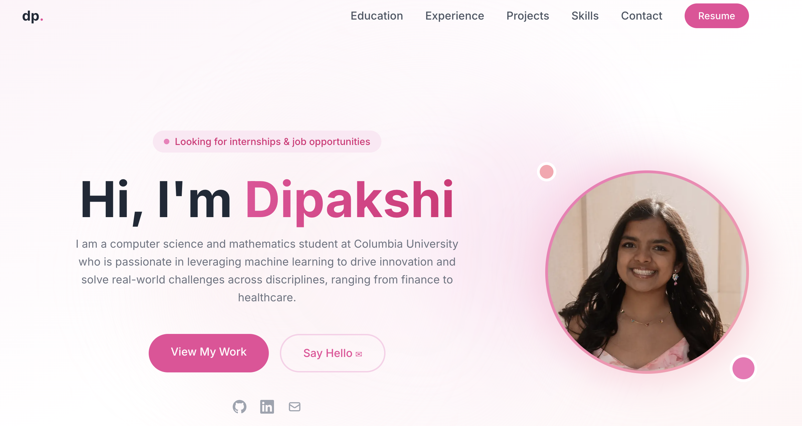

# Website Portfolio

A personal portfolio website built to explore front-end design through Next.js, TypeScript, and Tailwind CSS. 

🔗 **Live Site:** [dipakshi.vercel.app](https://website-portfolio-cdn04dfbq-dipakshi-s-projects.vercel.app/)



---

## Pages

- **Hero**: Includes an introduction and links to social icons (Github, Linkedin, Email) and projects page.
- **Education**: Includes degree, relevant coursework, honors and awards, and activities. 
- **Experience**: Includes industry and research experiences. 
- **Projects**: Consists of a consolidated list of relevant projects and links to all repos, papers, and reports. 
- **Skills**: Covers Languages, Frontend, Backend & Data, ML & Data Science, and Tools & DevOps. 
- **Contact**: Contains information on how to reach out and connect (with links).

---

## Built With

- **[Next.js](https://nextjs.org/)**: React framework with App Router
- **[TypeScript](https://www.typescriptlang.org/)**: Type-safe JavaScript
- **[Tailwind CSS](https://tailwindcss.com/)**: CSS framework
- **[Vercel](https://vercel.com/)**: For Deployment and hosting

---

## Running Locally

### Prerequisites

- Node.js 18+
- npm

### Setup

1. **Clone the repository**
   ```bash
   git clone https://github.com/diipakshii/website_portfolio.git
   cd website_portfolio
   ```

2. **Install dependencies**
   ```bash
   npm install
   ```

3. **Start the development server**
   ```bash
   npm run dev
   ```

   If that doesn't work use 
   ```bash
   ./node_modules/.bin/next dev
   ```

4. **Open in browser**
   ```
   http://localhost:3000
   ```

---

## Deploying on Vercel

1. Push code to GitHub
2. Go to [vercel.com](https://vercel.com) and sign in with GitHub
3. Click **Add New Project** and import repository
4. Leave all settings as default (Vercel auto-detects Next.js)
5. Click **Deploy**

Once deployed, Vercel gives you a public URL. To make it accessible without login:
- Go to **Settings → Deployment Protection**
- Set to **None**

I have it deployed at [dipakshi.vercel.app](https://website-portfolio-cdn04dfbq-dipakshi-s-projects.vercel.app/)

---

## Customizing

All content is hardcoded into each component file, simply change anything you would like.

| What to change | Where |
|---|---|
| Name, bio, social links | `components/Hero.tsx` |
| Education, coursework, activities | `components/Education.tsx` |
| Experience | `components/Experience.tsx` |
| Projects | `components/Projects.tsx` |
| Skills | `components/Skills.tsx` |
| Contact info | `components/Contact.tsx` |

---

## License

This project is open source and available under the [MIT License](LICENSE).